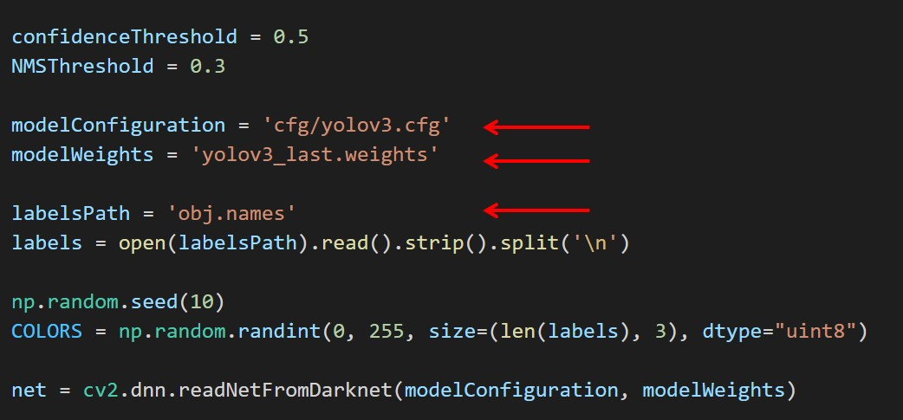
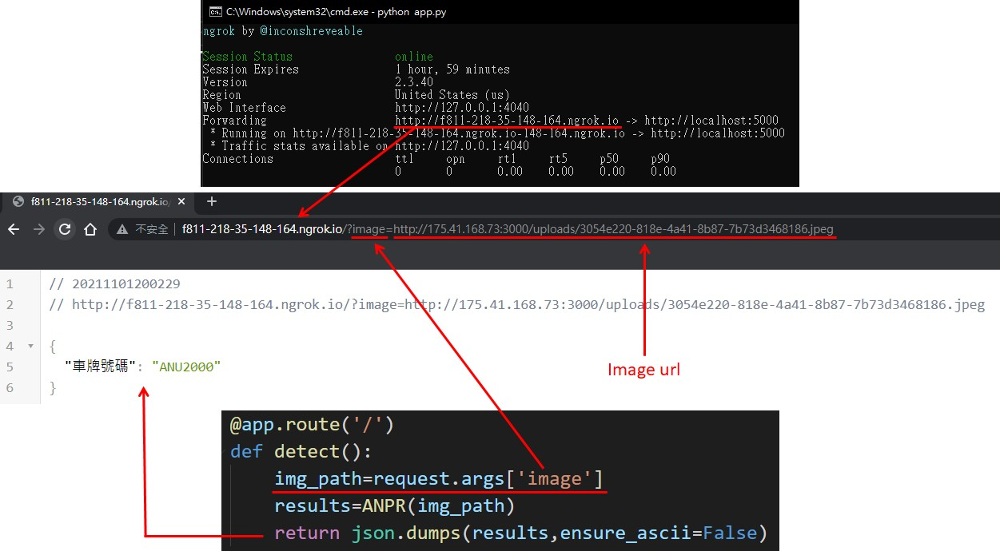
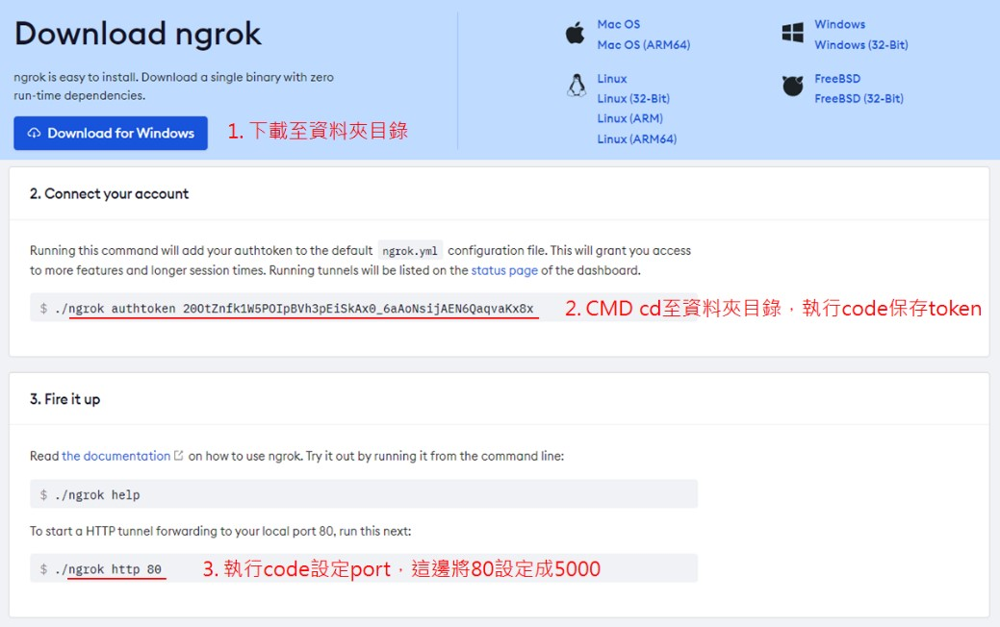
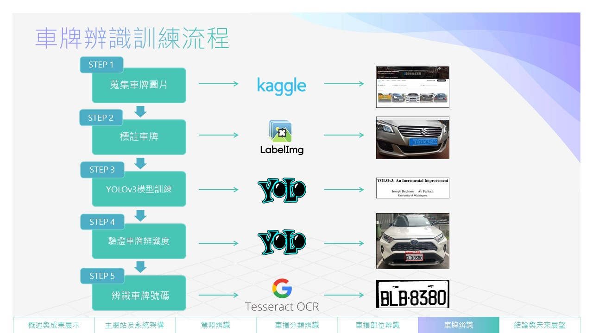
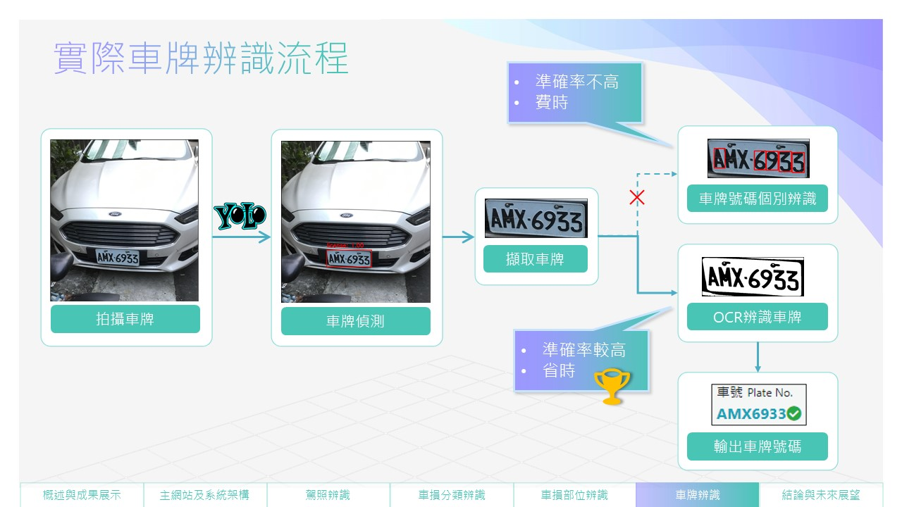

# yolov3-ANPR
## 使用工具
Anaconda3 的 Python3.8 環境 
Google Colab (GPU)
## 事前準備
本機安裝 [tesseract-ocr-w32-setup-v5.0.0-alpha.20210811.exe](https://digi.bib.uni-mannheim.de/tesseract/tesseract-ocr-w32-setup-v5.0.0-alpha.20210811.exe) 
安裝相關套件: `pip install -r requirements.txt`
## Dataset
在 [kaggle](https://www.kaggle.com/andrewmvd/car-plate-detection) 找到已經label好汽車車牌的資料 
下載後，將資料夾中的 annotations、images 資料夾獨立壓縮成 annotations.zip、images.zip，再放到自己的 google drive 根目錄中。 
如果想要手動標記，推薦使用 [labelImg](https://blog.gtwang.org/useful-tools/labelimg-graphical-image-annotation-tool-tutorial/) 這套程式
## Training Yolov3 Model
[Colab程式碼](https://colab.research.google.com/drive/1gBq9PdVq7FkUchwC_IVIcipQe1-GAnaT?usp=sharing) (內附參考資料來源) 
模型訓練完成後，會在雲端保留 `yolov3.cfg`、`obj.names`、`yolov3_last.weights`。
## Car Plate Recognition
參考來源: https://github.com/mohitwildbeast/YOLO-v3-Object-Detection 
下載 source code，將上一步驟產出的 `yolov3.cfg` 放置於 cfg 資料夾中，`obj.names`、`yolov3_last.weights` 放置在根目錄下(可自行規劃)，最後修改 `yolo_detection_images.py` 內對應路徑，再執行該程式即可完成初步的車牌位置辨識。

## Car Plate Number Recognition
框出車牌位置後，還需完成車牌號碼的辨識。 
參考 [yolov4-custom-functions
](https://github.com/theAIGuysCode/yolov4-custom-functions) 中的 core/utils.py ，擷取函數 recognize_plate 程式碼，整理成 `yolov3_ANPR_module.py`。
## Flask
執行 `app.py` 啟動 server 。 
於網址列中輸入對應網址，即可呈現車牌號碼辨識結果。 

為了解決 Python Flask 不能長時間運行，結合 ngrok 架一個本地端的Http伺服器。 
ngrok 官網 (需登入): https://dashboard.ngrok.com/get-started/setup 
參考介紹: https://xiaosean.github.io/server/2018-04-18-Flask_Ngrok/ 

設定完 port 5000 後，另開一個 CMD ，重新執行 `app.py`。

# 專題發表

